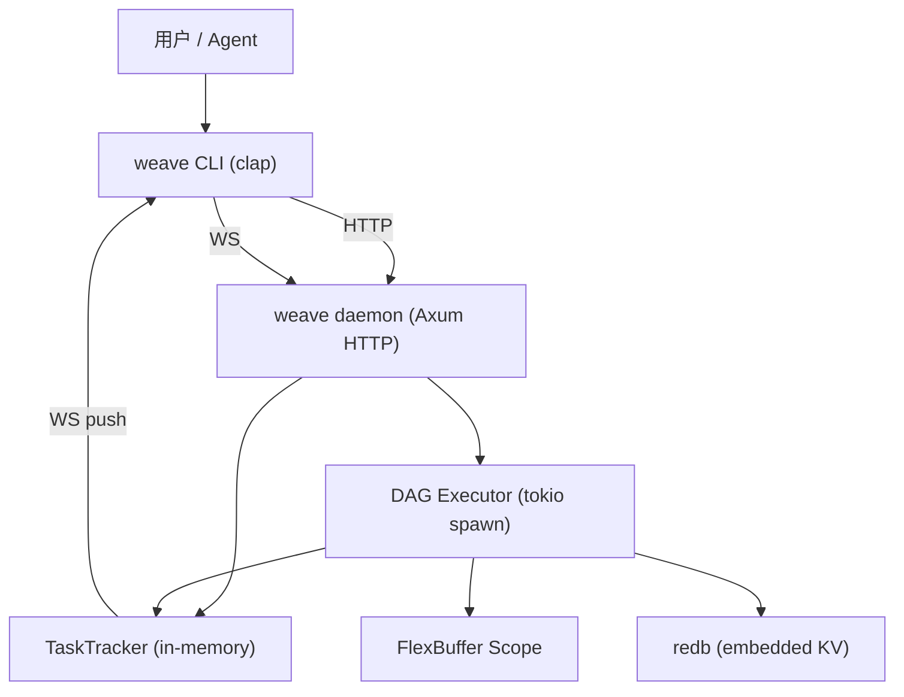
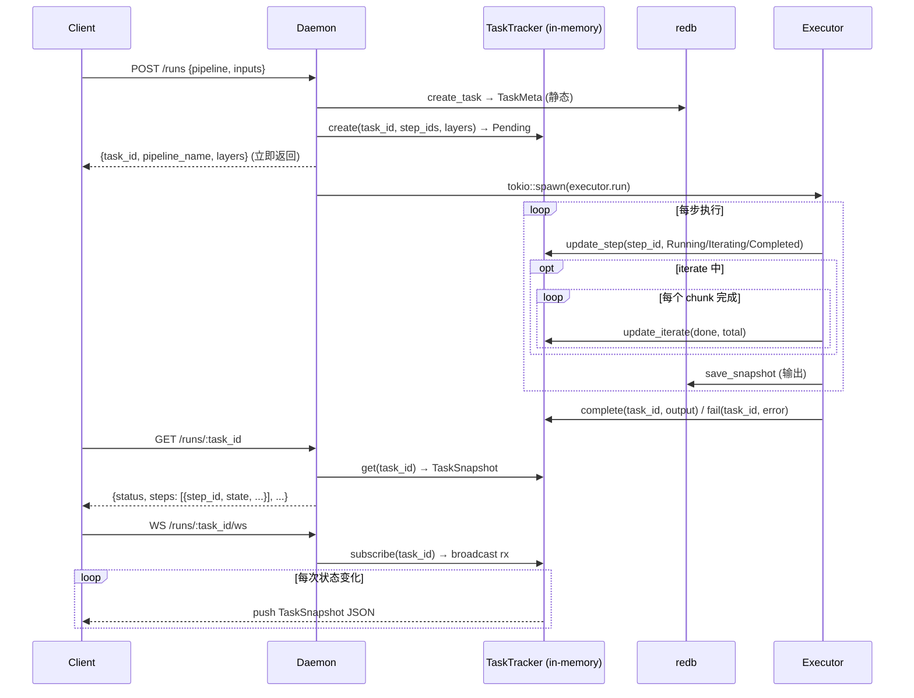

# weave — DAG 批处理引擎

## 定位

通用的算子编排 + DAG 批处理引擎。纯 Rust，单一二进制 `weave`（CLI + daemon）。FlexBuffer 自描述 scope，增量快照，实时进度推送。



## 核心设计决策

| 维度 | 决策 |
|------|------|
| 算子扩展 | 编译期注册，`#[async_trait]` + OperatorRegistry |
| 类型安全 | JSON Schema，上传时编译，运行前校验 |
| 输入模型 | Pipeline 级 slots（占位符声明），Step 级 inputs（任意 JSON） |
| 观测性 | 增量快照（每步只存当前 output bytes）；异步 task_id；内存 TaskTracker + WS 实时推送；ratatui TUI / plaintext 两种进度模式 |
| 部署 | 单一二进制 `weave` — CLI 命令调 daemon（Axum HTTP） |
| Scope | FlexBuffer bytes — 自描述二进制，无需 schema 文件 |
| 存储 | redb（五表：PIPELINE/TASK/SNAPSHOT/OBJECT/CACHE）。所有值全内联存储，无外部 spill 文件 |
| 缓存 | SHA256(resolved input bytes) 内容寻址去重 |
| 变量系统 | `{slots.name}` / `{env.KEY}` / `{step_id.output}` / `{step_id.output.field}` |
| 迭代 | `step.iterate { over, as, max_workers, batch }` — batch=None: 裸对象; batch=Some: 数组批次。max_workers 省缺 rayon 自动 |
| 并行 | DAG 层内 `join_all` 并发 + iterate `join_all` chunk 并行 + 算子内 rayon 并行 |

## 项目结构

```
weave/
├── Cargo.toml
├── build.rs                    # (empty, FlexBuffers 无需编译)
├── src/
│   ├── main.rs                 # CLI 入口 (clap)
│   ├── lib.rs
│   ├── dsl/                    # DSL 解析层
│   │   ├── parser.rs           YAML → PipelineDef
│   │   ├── schema.rs           SlotDef, StepDef, RetryDef, IterateConfig, RefValue
│   │   └── validator.rs        错误 + 警告校验
│   ├── store/                  # 存储层
│   │   ├── mod.rs              Database 门面 (redb)
│   │   ├── database.rs         redb 表定义 + Key/Value impl
│   │   └── object.rs           ObjectDigest + ObjectValue（全内联，无 spill）
│   ├── task/                   # Task 运行时
│   │   ├── mod.rs              TaskId/PipelineId + TaskMeta
│   │   ├── scope.rs            Scope (FlexBuffer-backed)
│   │   ├── progress.rs         StepProgress/TaskStatus 状态机
│   │   ├── tracker.rs          TaskTracker (in-memory 运行时状态 + broadcast)
│   │   └── snapshot.rs         Snapshot (增量，存 output bytes)
│   ├── runtime/                # DAG 执行器
│   │   ├── dag.rs              Dag + Kahn 拓扑排序
│   │   └── executor.rs         Executor (层内并行 / 缓存 / 重试 / iterate / tracker 集成)
│   ├── operator/               # 算子系统
│   │   ├── trait.rs            Operator trait (data: &[u8], config: &Value → Cow<[u8]>)
│   │   ├── registry.rs         OperatorRegistry
│   │   └── builtin/            # 内置算子 (9个)
│   └── cli/                    # CLI 支持
│       ├── daemon.rs           serve + daemon start/stop/restart
│       ├── client.rs           HTTP + WS client
│       └── watch.rs            ratatui TUI + --text-output 进度渲染
├── tests/                      # 集成测试
├── benches/etl.rs              # ETL benchmark
└── AGENTS.md
```

## 进度追踪架构



### API 端点

| 方法 | 路径 | 说明 |
|------|------|------|
| POST | `/runs` | 提交任务，立即返回 `{task_id, pipeline_name, layers}` |
| GET | `/runs/:task_id` | 查询 task，含静态 meta + 动态 `progress` 字段 |
| WS | `/runs/:task_id/ws` | 订阅实时进度，每次状态变化 push TaskSnapshot JSON |

### CLI 进度模式

- `weave run --watch <name>` — ratatui 全屏 TUI：layer 编号、`{ }` 并行括号、step 状态图标、iterate 进度条 + 计数
- `weave run --text-output <name>` — 纯文本流式输出，适合 CI/CD / Agent
- `weave run <name>` — 同步阻塞模式（兼容旧行为）

## Operator Trait

```rust
#[async_trait]
pub trait Operator: Send + Sync {
    fn spec(&self) -> OperatorSpec;
    /// data: scope 中零拷贝取出的 bytes
    /// config: DSL 静态配置
    /// 返回 Cow<[u8]>: noop 返回 Borrowed，其余 Owned
    async fn run<'a>(&self, data: &'a [u8], config: &Value) -> Result<Cow<'a, [u8]>, OperatorError>;
}

pub struct OperatorSpec {
    pub type_name: &'static str,
    pub description: &'static str,
    pub iterate: bool,
    pub cache: bool,
}
```

## TaskTracker

```rust
pub struct TaskTracker {
    runs: Mutex<HashMap<TaskId, RunState>>,  // 每 task 一个 broadcast tx
}

impl TaskTracker {
    pub async fn create(task_id, pipeline_name, step_ids, layers) → (broadcast::Receiver, TaskSnapshot);
    pub async fn update_step(task_id, step_id, StepState);     // Pending → Running → Iterating → Completed/Failed
    pub async fn update_iterate(task_id, step_id, done, total); // 每个 chunk 完成时更新 iterate 计数
    pub async fn complete(task_id, output);
    pub async fn fail(task_id, error);
    pub async fn get(task_id) → Option<TaskSnapshot>;
    pub async fn subscribe(task_id) → Option<broadcast::Receiver<Vec<u8>>>;
}
```

## DSL 语法

```yaml
name: batch_etl
slots:
  - name: source_url
    schema: { type: string, pattern: "^https?://" }

steps:
  - id: api_key
    type: var
    inputs:
      key: "{env.OPENAI_API_KEY}"

  - id: extract
    type: http
    inputs:
      url: "{slots.source_url}"
      method: GET

  - id: transform
    type: filter
    inputs:
      data: "{extract.output.body}"
      field: "age"
      operator: "gte"
      value: 18

  - id: batch
    type: split
    inputs:
      data: "{transform.output}"
      size: 100

  - id: load
    type: http
    iterate:
      over: "{batch.output}"
      as: "item"
      batch:
        size: 100
    inputs:
      url: "https://api.example.com/ingest"
      body: "{item}"
      method: POST
    retry:
      max_attempts: 3
      backoff: exponential
      delay_ms: 1000

output: "{load.output}"
```

## DSL Schema

```rust
pub struct PipelineDef {
    pub name: String,
    pub description: Option<String>,
    pub storage: Option<StorageDef>,
    pub slots: Vec<SlotDef>,
    pub steps: Vec<StepDef>,
    pub output: String,
}

pub struct StepDef {
    pub id: String,
    pub r#type: String,
    pub after: Option<Vec<String>>,
    pub iterate: Option<IterateConfig>,  // step 根级
    pub inputs: Option<Value>,           // 纯算子参数
    pub cache: Option<bool>,
    pub retry: Option<RetryDef>,
    pub timeout: Option<u64>,
    pub code: Option<String>,            // 内联 JS（type="js" 时）
}

pub struct IterateConfig {
    pub over: String,                    // 变量引用
    pub as_name: String,                 // 元素变量名
    pub max_workers: Option<u32>,        // 省缺 → rayon 自动
    pub batch: Option<BatchConfig>,
}
```

## 内置算子

| 算子 | 功能 | 状态 |
|------|------|------|
| `http` | HTTP 请求 | ✅ |
| `filter` | 按条件过滤数组（rayon 并行） | ✅ |
| `sort` | 按字段排序数组（rayon 并行） | ✅ |
| `dedup` | 数组去重 | ✅ |
| `merge` | 合并两个对象 | ✅ |
| `split` | 将数组切分为小块 | ✅ |
| `base64` | Base64 编解码 | ✅ |
| `noop` | 直接返回输入（测试用） | ✅ |
| `var` | 变量占位——接受任意 inputs 原样输出 | ✅ |
| `js` | 内联 QuickJS 沙箱（code 字段写源码） | ✅ |

## 实践踩坑 & 需求（2025-07）

以下是在真实 PDF OCR 场景中使用 weave 发现的问题和改进建议。

### API/DX 层面

1. **JS 算子访问 input 的方式不直观** — `input.config.<key>` 和 `input.<key>` 语义不明确，实测后者始终为 undefined。应该统一为 `input.<key>` 或者文档里明确说明。

2. **`--text-output` 不打印最终产出** — 跑完只显示 `[weave] completed in Xms`，无任何步骤产出。期望行为：打印 `output` 字段指向的最终值（纯文本时），或至少打印所有 step 的产出摘要。

3. **`pipeline apply` 应支持 upsert** — 同名 apply 总是新建，产生重复记录。期望：按 name 幂等更新（可用 `--upsert` flag 或默认识别同名）。

4. **`pipeline delete` 应支持按名字删除** — 当前必须用 UUID，但用户面向的是名字。期望 `weave pipeline delete pdf_ocr` 能直接删。

5. **`pipeline apply`/`inspect` 应校验未注册的 step type** — `type: command` 在 apply 时不报错，运行时才报 `未注册: command`。应在 apply/inspect 阶段就提示。

6. **需暴露 step type 的白名单/已有算子列表** — 用户无从知道有哪些算子可用、哪些已注册。期望 `weave system operators` 列出可用算子。

### 算子能力

7. **JS 错误应带栈信息** — 当前只报 `Exception generated by QuickJS`，无行号、无具体错误消息。排查极其困难，必须逐行注释猜测。

8. **file 算子需支持读取二进制/大文件** — 10MB PDF 返回 null（`typeof === "object"` 但 isNull:true），3KB 文本文件正常。应支持二进制模式或至少返回 base64，否则 PDF OCR 等场景无法落地。

9. **file 算子的快照输出始终为 null** — 即使数据实际已传给下一步。排查时容易误判 file 返回空值。

10. **需 `command` 算子，可执行 shell** — 很多场景需要 `curl`/`base64`/`python3` 等做预处理或胶水逻辑，当前 `command` 未注册，无 workaround。

11. **CLI `-i` 参数应支持从文件读取** — 大 base64（如 13MB）无法通过 `-i key=value` 传入。期望 `-i key=@/path/to/file` 读取文件内容。

12. **需 `base64` 算子**（内置算子表已有但无文档）— PDF 等二进制数据需先编码再传入 JS 算子。

## 设计原则

1. **纯 Rust 核心** — 单一二进制，编译期类型安全
2. **算子即 Trait** — 内置编译期可用 + DSL 内联 JS（`type: js` + `code` 字段）
3. **JSON Schema 贯穿全流程** — 上传时编译，运行前校验
4. **DSL 自描述** — YAML 声明，Git 版本控制
5. **Agent-native** — 异步 task_id，面向 AI 调用方
6. **全可观测** — 增量快照 + TaskTracker 实时推送 + WS + TUI
7. **化繁为简** — 只有 `inputs`，没有 params/vars/templates
8. **默认并行** — DAG 层内 + iterate + 算子内三层并行
9. **自描述 Scope** — FlexBuffer bytes，无需 schema 文件
