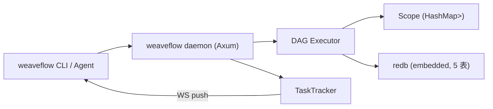

# weaveflow

DAG 批处理引擎——YAML 定义管道，Rust 单二进制执行，面向 AI Agent 与数据处理。



## 快速开始

```bash
cargo install --path .

weaveflow daemon start                          # 127.0.0.1:9928
weaveflow check -f pipeline.yml                 # 本地校验（无需 daemon）
weaveflow pipeline apply -f pipeline.yml        # 注册
weaveflow run etl_demo -i source_url=<url>      # 运行
weaveflow run etl_demo --watch                  # TUI 实时进度
weaveflow run etl_demo --text-output --output json   # JSONL 流（CI/Agent）
weaveflow task snapshot list <task-id>          # 回放每步输出
weaveflow daemon stop
```

一个 pipeline 长这样：

```yaml
name: etl_demo

slots:
  - name: source_url
    schema: { type: string }

steps:
  - id: fetch
    type: http
    timeout_sec: 30
    inputs:
      url: "{slots.source_url}"
      method: GET

  - id: adults
    type: filter
    inputs:
      data: "{fetch.output.body}"
      field: "age"
      operator: "gte"
      value: 18

output: "{adults.output}"
```

- **steps 组成 DAG**：`{step_id.output}` 引用即依赖，同层并行执行
- **iterate**：数组逐元素并行展开（`over: "{...}"`，当前元素绑定 `as` 名，`{item...}` 在 inputs 任意字段解析）
- **retry / timeout_sec / cache**：step 根级声明，逐次尝试生效
- **12 个内置算子**：http / js / filter / sort / dedup / merge / base64 / noop / var / file / command / llm
- **js 算子**：`inputs.code` 内联 QuickJS 沙箱，无 fs/net，`timeout_sec` 可真中断死循环

## 文档

| 文档 | 内容 |
|------|------|
| [docs/guide.md](docs/guide.md) | 使用手册：CLI 全参考、daemon 生命周期、故障排查 |
| [docs/dsl.md](docs/dsl.md) | DSL 字段级参考 |
| [docs/operators.md](docs/operators.md) | 12 个算子的输入/输出/限制 |
| [docs/api.md](docs/api.md) | HTTP/WS API 参考（请求/响应 schema） |
| [docs/agent.md](docs/agent.md) | Agent 集成指南（JSONL 流、取结果模式） |
| [docs/architecture.md](docs/architecture.md) | 架构设计（引擎语义、存储、并发） |
| [docs/security.md](docs/security.md) | 安全模型（**无鉴权，仅限 localhost**） |

导航入口：[docs/README.md](docs/README.md)。贡献者约定：[AGENTS.md](AGENTS.md)。

## 开发

```bash
cargo build
cargo test --lib          # 186 单元测试
cargo test --test '*'     # 51 集成测试（in-process，无需 daemon）
cargo bench --bench '*'   # 5 ETL benches
cargo clippy --all-targets   # 保持 0 warning
```

## 安全提示

daemon 所有端点**无鉴权**：绑定非 loopback 地址 = 未授权 RCE。仅在 localhost 使用，详见 [docs/security.md](docs/security.md)。

## License

AGPL-3.0-only，见 [LICENSE](LICENSE)。
