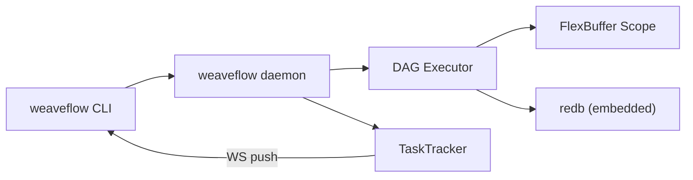
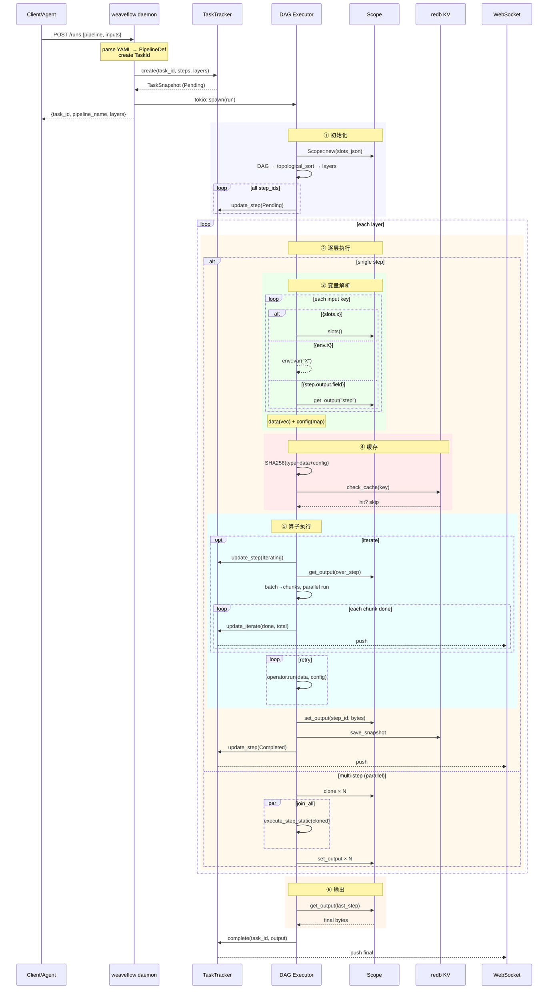

# weaveflow

DAG 批处理引擎——YAML 定义管道，Rust 执行，面向 AI Agent 和数据处理。v0.2.1



## 单 Task 数据流



## 快速开始

```bash
# 安装
cargo install --path .

# 启动 daemon
weaveflow daemon start

# 注册 pipeline
weaveflow pipeline apply -f examples/demo.yaml

# 运行
weaveflow run demo -i source_url=https://api.example.com/data

# 运行 + 实时进度
weaveflow run demo --watch
weaveflow run demo --text-output   # CI/Agent 友好

# 查看结果
weaveflow task ls
weaveflow task snapshot list <task-id>
weaveflow task snapshot show <task-id> <seq>

# 停止 daemon
weaveflow daemon stop
```

## 核心概念

```yaml
name: etl_demo

slots:
  - name: source_url
    schema: { type: string }

steps:
  - id: fetch
    type: http
    inputs:
      url: "{slots.source_url}"
      method: GET

  - id: filter
    type: filter
    inputs:
      data: "{fetch.output}"
      field: "age"
      operator: "gte"
      value: 18

  - id: send
    type: http
    iterate:
      over: "{filter.output}"
      as: "item"
      batch:
        size: 100
    inputs:
      url: "https://api.example.com/ingest"
      method: POST
      body: "{item}"
    retry:
      max_attempts: 3
      backoff: exponential
      delay_ms: 1000

output: "{send.output}"
```

- **steps** 组成 DAG，通过 `{step_id.output}` 引用建立依赖
- **after** 声明纯顺序依赖（无数据传递）
- **slots** 声明调用方参数，`{slots.name}` 引用
- **{env.KEY}** 引用环境变量
- **iterate** 逐元素并行展开：无 batch 时每元素作为裸对象传给算子，有 `batch.size` 时按数组批次传给算子。`max_workers` 省缺 = rayon 自动。
- **retry** 含 max_attempts + backoff
- **DAG 层内并行** — 同层无依赖步骤 `join_all` 并发执行
- **算子内并行** — filter/sort 用 rayon 并行
- **缓存** — SHA256(resolved input bytes) 自动缓存算子输出
- **增量快照** — 每步只存当前步骤输出 bytes
- **实时进度** — `--watch` TUI / `--text-output` 纯文本 / WebSocket push

### 内联 JS

无需预注册算子，直接在 DSL 中写 JS 代码：

```yaml
steps:
  - id: custom
    type: js
    code: |
      function run(input) {
        return input.data.filter(o => o.status === 'paid');
      }
    inputs:
      data: "{slots.orders}"
```

## CLI

```bash
weaveflow daemon start [--bind 127.0.0.1:9928]
weaveflow daemon stop
weaveflow daemon restart [--bind 127.0.0.1:9928]

weaveflow pipeline apply -f pipe.yaml
weaveflow pipeline ls|list
weaveflow pipeline inspect <name>

weaveflow run <name> [-i k=v] [-i k=@file.json]
weaveflow run <name> --watch           # ratatui 进度
weaveflow run <name> --text-output     # CI/Agent 纯文本流

weaveflow task ls|list
weaveflow task snapshot list <task-id>
weaveflow task snapshot show <task-id> <seq>

weaveflow system prune [--force] [--dry-run]
```

所有命令支持 `--daemon=HOST:PORT` 连接远程 daemon。

## 内置算子

| 算子 | 功能 |
|------|------|
| `http` | HTTP 请求 |
| `filter` | 数组过滤（eq/ne/gt/gte/lt/lte/in/contains），rayon 并行 |
| `sort` | 排序（asc/desc），rayon 并行 |
| `dedup` | 去重 |
| `merge` | 对象合并 |
| `base64` | 编解码 |
| `noop` | 直通（测试用） |
| `var` | 变量占位 |
| `js` | 内联 JS（`code` 字段写源码，QuickJS 沙箱执行） |

## v0.2 架构变化

| v0.1 | v0.2 |
|------|------|
| `serde_json::Value` scope | FlexBuffer `Vec<u8>` (自描述二进制，无需 schema) |
| `inputs.iterate` (嵌套) | `step.iterate` (根级) |
| 全量 scope 快照 | 增量快照 (只存当前 step output) |
| ObjectDigest 缓存 | SHA256(resolved input bytes) |
| 算子 Registry + 预注册 | 删除，内联 JS `type: js` + `code` |
| spill/blobstore | 删除 (全内联) |
| 同步 POST /runs | 异步 task_id + TaskTracker + WS 实时推送 + TUI |

## 技术栈

Rust · tokio · Axum · redb · FlexBuffers · serde · clap · criterion · rayon · rquickjs · ratatui

## License

MIT
