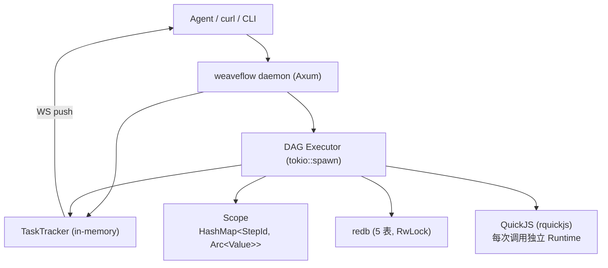

# weaveflow 架构设计

> 面向贡献者的内部行为说明。使用视角看 [guide.md](guide.md)；工程约定（测试/提交/目录）看根目录 [AGENTS.md](../AGENTS.md)。

## 产品定位

weaveflow 是 **DAG 批处理引擎**，面向 AI Agent 与数据处理场景：

- ETL 管道：API 拉取 → 过滤/变换 → 写入目标
- 批量处理：数组逐元素并行展开（iterate）
- LLM 链：多步 prompt 串联聚合
- 内联 JS：QuickJS 沙箱执行自定义逻辑

设计目标：纯 Rust 单二进制、异步 task_id 的 Agent-native API、编译期校验尽量前置、全链路可观测（快照 + WS 推送 + TUI）。

## 进程模型



二进制内分三层：`lib.rs`（dsl/engine/operator/quickjs/store/tracker/vm，可单测）+ `server/`（daemon 侧）+ `cli/`（CLI 侧），后两者仅进 binary。

## 请求生命周期

```
1. 注册 Pipeline         POST /pipelines (YAML body)
   ├─ parse: YAML → RawPipelineDef（deny_unknown_fields）→ TryFrom → PipelineDef
   │         （"{...}" 整串 → RefValue::Ref；object/array 字面量内嵌 → 单键 {"Ref":..} tag）
   ├─ validate() → errors（阻断）/ warnings（提示）
   └─ save_pipeline_upsert() → redb（单写事务内扫描+插入，同名 upsert）

2. 执行任务              POST /runs { pipeline, inputs }
   ├─ in_flight++ 后复查 draining（关 TOCTOU），draining → 503
   ├─ find_pipeline_by_name → Dag::from_pipeline → 拓扑分层
   ├─ create_task（redb）+ tracker.create（内存）
   ├─ 立即返回 { task_id, pipeline_name, status, layers }
   └─ tokio::spawn 后台执行（semaphore permit 在后台任务内获取）：
      │  每个 DAG 层 join_all 并行；每个 step：
      ├─ resolve_value_tree（RefValue::Ref → Value，来自 Scope）
      ├─ 查缓存（SHA256(op_type + ":" + inputs_json)；iterate 混入 over 数组）
      ├─ 算子执行（retry 包裹每次尝试；timeout_sec 包裹算子 future）
      │    iterate：按 over 数组切 chunk，每 chunk 独立 retry+timeout，
      │    当前元素固定注入 inputs["data"]
      ├─ save_snapshot（Snapshot v2 → SNAPSHOT 表）
      ├─ scope.set_output(step_id, Arc<Value>)
      └─ tracker 更新（Running/Iterating/Completed/Failed → WS 广播）
   另有 watcher 任务：runner panic → fail_non_terminal_steps + 任务置 Failed，
   并无条件 in_flight--（保证 wait_for_drain 收敛）

3. 查询进度              GET /runs/:task_id
   └─ TaskMeta（redb）+ progress（Tracker 内存快照，终态任务被回收后缺省）

4. 实时推送              WS /runs/:task_id/ws
   └─ snapshot_and_subscribe() 单次加锁返快照+订阅，随后 broadcast 推送
```

## 引擎执行语义

- **DAG 边**只有两个来源：`inputs` 中的 `{step.output}` 引用（数据+顺序）与 `after`（纯顺序）。纯 String 字段（`filter.field`、`http.method` 等）永不产生依赖。
- **Scope**：`HashMap<StepId, Arc<Value>>`——get/set O(1)，clone 仅引用计数；并行层各自拿克隆的 Scope，层结束后合并写回。env 密钥集合在 poison-tolerant Mutex 后，用于快照脱敏。
- **Resolver**：`resolve_value_tree` 递归解析；`{step.output.0.field}` 数组下标严格（非数字段/越界 = 硬错误）；缺失 object 字段 → `Null` + warn。
- **超时只在 step 层**：`timeout_sec` 用 `tokio::time::timeout` 包裹算子 future。HTTP client、子进程、QuickJS 自身均无隐式总超时。JS 算子经 drop-guard 触发 QuickJS interrupt，真中断 `while(1){}`。
- **缓存**：命中报 `attempts=0, cached=true`；写失败仅 warn 不影响结果；`cache_enabled = step.cache ?? op.spec().cache`。
- **重试**：`retry_with_op` 按 attempt 包裹；iterate 模式每个 chunk 独立计重试，不是整个 step 一次重试。

## 并发模型

| 层 | 机制 | 上限 |
|----|------|------|
| 任务间 | daemon 信号量（`--max-concurrent-tasks`，默认不限） | 配置值 |
| DAG 层内 | `join_all` | 层宽 |
| iterate chunk | `join_all` 分批 | `max_workers`（缺省 = `available_parallelism`，≤1024） |
| 算子内 | rayon（filter/sort） | rayon 全局线程池 |

## 存储层（redb）

五张表在 `Database::open` 预创建；schema 以类型名版本化（`::v1`、Snapshot `::v2`）：

| 表 | Key | Value |
|----|-----|-------|
| `pipeline` | PipelineId (UUID 16B) | PipelineDef (serde_json) |
| `task` | TaskId (UUID 16B) | TaskMeta（含 `result_ttl_secs`） |
| `snapshot` | SnapshotKey `[task_id 16B][seq u64 BE 8B]` | Snapshot v2：`seq(8B)‖step_id_len(4B)‖step_id‖output` |
| `object` | ObjectDigest (SHA256 32B) | ObjectValue（**全内联，无 spill、无 ref_count**） |
| `cache` | CacheKey (SHA256 32B) | ObjectDigest (32B) |

- 并发：`RwLock<redb::Database>`（poison-tolerant），写锁仅 `compact()` 使用；redb 写事务全局串行，`save_pipeline_upsert` 借此实现同名原子 upsert。
- v0 数据库打开时自动迁移：备份 `.v0.bak` → 拷贝 PIPELINE/TASK → 丢弃 SNAPSHOT/OBJECT/CACHE。
- **Prune 两阶段**：`prune_scan`（只读，记录扫描时刻 max_seq）→ `prune_execute`（写事务）：跳过 tracker 运行中任务与无快照的 running 任务；只删 seq ≤ max_seq 的快照（扫描期间新写的存活）；GC 无引用 OBJECT 与悬空 CACHE；最后 compact。
- `find_pipeline_by_name` 是全表扫描——**有意为之**（pipeline 数量小）。

## TaskTracker

```
TaskTracker
  └─ Mutex<HashMap<TaskId, RunState>>（poison-tolerant）
       ├─ Progress { steps: Vec<StepProgress> }     StepState 状态机见下
       ├─ broadcast::Sender<Vec<u8>>（capacity 64，Lagged 静默跳过）
       └─ layers: Vec<LayerInfo>                     TUI/前端渲染并行分组

StepState: Pending → Running ⇄ (retry) → Completed
                 ↘ Iterating（progress total/done）↗
                 ↘ Failed / Skipped
```

- `snapshot_and_subscribe()` 单次加锁完成"取快照 + 订阅"，无 get-then-subscribe 竞态。
- `cleanup_stale()` 回收终态超过 10 分钟的任务，tracker 内存不无界增长。
- `running_task_ids()` 喂给 prune，运行中任务永不被清理。
- daemon 重启后 tracker 清空：持久层任务状态由 `mark_interrupted` 兜底为 `failed_interrupted`。

## 关闭流程

收到 SIGTERM/SIGINT → `draining=true` → `/runs` 返回 503 → 等在途任务排空（`wait_for_drain`，上限 `--shutdown-drain` 默认 30s）→ 退出。`daemon stop --timeout`（默认 35s，应 ≥ drain）后 SIGKILL。

## 算子系统

编译期注册：`builtin/mod.rs::get_builtin` 一个 `match`，`#[async_trait] Operator { spec(); run(inputs: Value) -> Result<Value> }`。新增算子要改三处（`step_op.rs` 变体 + `raw.rs` Raw 变体/From 臂 + `builtin/` 实现与 match 臂），缺一编译错误。无运行时注册表。`GET /system/operators` 只读暴露 spec（type_name/description/iterate/cache）。

## 技术栈

| 层 | 选型 |
|----|------|
| 语言 | Rust edition 2024 |
| 存储 | redb（事务 KV，全内联） |
| Web | Axum 0.7（HTTP + WS） |
| 异步 | tokio |
| 序列化 | serde + serde_json + rust-yaml |
| 内容寻址 | SHA256 (sha2) |
| JS 运行时 | rquickjs（QuickJS 内嵌，256MB 内存 / 1MB 栈） |
| JSON Schema | jsonschema |
| 并行 | rayon |
| 错误 | thiserror + WeaveflowError 统一枚举 → HTTP 映射 |
| TUI | ratatui + crossterm |
