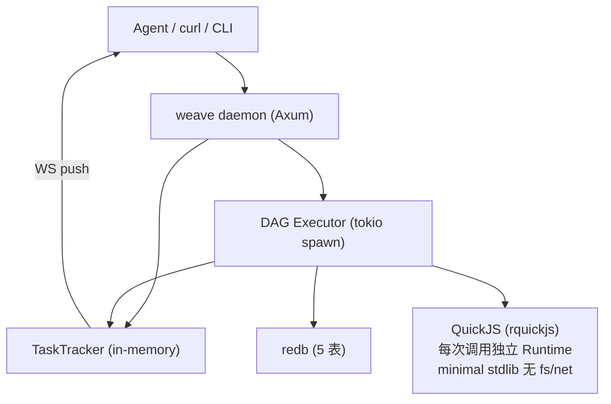

# weave 架构设计

> 产品目的、运行架构、核心组件。DSL 详细语法参考 [dsl.md](dsl.md)。

## 产品目的

weave 是一个 **DAG 批处理引擎**，面向 AI Agent 和数据处理场景。

核心场景：

- **ETL 管道**：从 API 拉取数据 → 过滤/变换 → 写入目标
- **数据分批处理**：大批量记录切分后逐元素处理
- **LLM 链**：多步 prompt 串联（规划 → 撰写 → 审阅）
- **内联 JS**：QuickJS 沙箱执行 DSL 中内联的 JS 代码（无需预注册）

设计目标：

1. **纯 Rust 单二进制** — `weave` CLI + daemon（Axum HTTP）
2. **Agent-native API** — 异步 task_id，面向 AI 调用方
3. **严格类型安全** — JSON Schema 贯穿全流程
4. **全可观测** — 增量快照 + TaskTracker 实时推送 + WS + TUI

## 进程模型



## 请求生命周期

```
1. 注册 Pipeline         POST /pipelines (YAML body)
   ├─ YAML → PipelineDef
   ├─ validate() → errors/warnings
   └─ save_pipeline() → redb

2. 执行任务              POST /runs { pipeline, inputs }
   ├─ 生成 task_id (UUID v4)
   ├─ 构建 DAG + 拓扑排序
   ├─ 注册 TaskTracker（in-memory）
   ├─ 立即返回 { task_id, pipeline_name, layers }
   └─ tokio::spawn 后台执行:
       ├─ resolve_step_inputs（变量引用 → bytes）
       ├─ resolve_operator（内置名 或 inline JS）
       ├─ parse_iterate_config（若存在，展开数组）
       ├─ 查缓存（CACHE 表，SHA256 单 digest key）
       ├─ 算子执行（含重试 + backoff）
       ├─ 快照（Snapshot → SNAPSHOT 表）
       ├─ TaskTracker 更新（每步 Running/Iterating/Completed/Failed）
       └─ 完成 → tracker.complete(output) / tracker.fail(error)

3. 查询进度              GET /runs/:task_id
   └─ TaskMeta（DB）+ progress（Tracker in-memory）

4. 实时推送              WS /runs/:task_id/ws
   └─ broadcast TaskSnapshot JSON 每步状态变化
```

## 存储层

| 表 | Key | Value | 宽度 |
|----|-----|-------|------|
| `pipeline` | PipelineId (UUID 16B) | PipelineDef (serde_json) | 变长 |
| `task` | TaskId (UUID 16B) | TaskMeta | 变长 |
| `snapshot` | SnapshotKey (UUID+seq 24B) | Snapshot (step_id + output bytes) | 变长 |
| `object` | ObjectDigest (SHA256 32B) | ObjectValue { ref_count, data } | 变长 |
| `cache` | CacheKey (SHA256 32B) | ObjectDigest (32B) | 64B |

All keys use natural binary encoding — no JSON intermediate. `SnapshotKey` = `[task_id: 16B][seq: u64 BE: 8B]`.

### Object System

- 全内联存储（v0.2 已删除 spill-to-disk）
- ref_count: incremented per reference, cleaned by prune
- Content-addressable: same value = same digest = no duplicate storage

## FlatBuffer Scope

运行时 scope 使用 FlatBuffer 编码：

- zero-copy 引用：`scope.get_output(step_id) → &[u8]`
- clone = memcpy：`scope.clone()` 只复制底层 bytes
- 每步执行后 `scope.set_output(step_id, &bytes)` 写入

## 算子系统

有两种算子来源：

1. **内置算子** — 编译期注册，名字查找（`filter`, `sort`, `http`, `js` 等 10 个）
2. **内联 JS** — DSL 中 `type: js` + `code: |`，Executor 创建 `JsOperator` 执行

无运行时注册表，无 DB 算子表，无 `/operators` API。

## TaskTracker

内存中的运行时状态管理：

```
TaskTracker
  └─ Mutex<HashMap<TaskId, RunState>>
       ├─ Progress { steps: [{ step_id, state: StepState }] }
       ├─ broadcast::Sender<Vec<u8>>  (per task)
       └─ layers: Vec<LayerInfo>      (用于 TUI 渲染)

StepState 状态机:
  Pending → Running → Iterating / Completed / Failed
```

- Executor 每步更新 → Tracker 广播
- WS 订阅 broadcast channel → push 给客户端
- GET /runs/:task_id 直接查询当前快照

## 技术栈

| 层 | 选型 |
|----|------|
| 语言 | Rust (edition 2024) |
| 存储 | redb (事务 KV, 全内联) |
| Web | Axum 0.7 (HTTP + WS) |
| 异步 | tokio |
| 序列化 | serde + serde_json + serde_yaml + FlatBuffers |
| 内容寻址 | SHA256 (sha2) |
| JS 运行时 | rquickjs (QuickJS 内嵌) |
| JSON Schema | jsonschema |
| 错误处理 | thiserror + WeaveError 统一枚举 |
| TUI | ratatui + crossterm |
